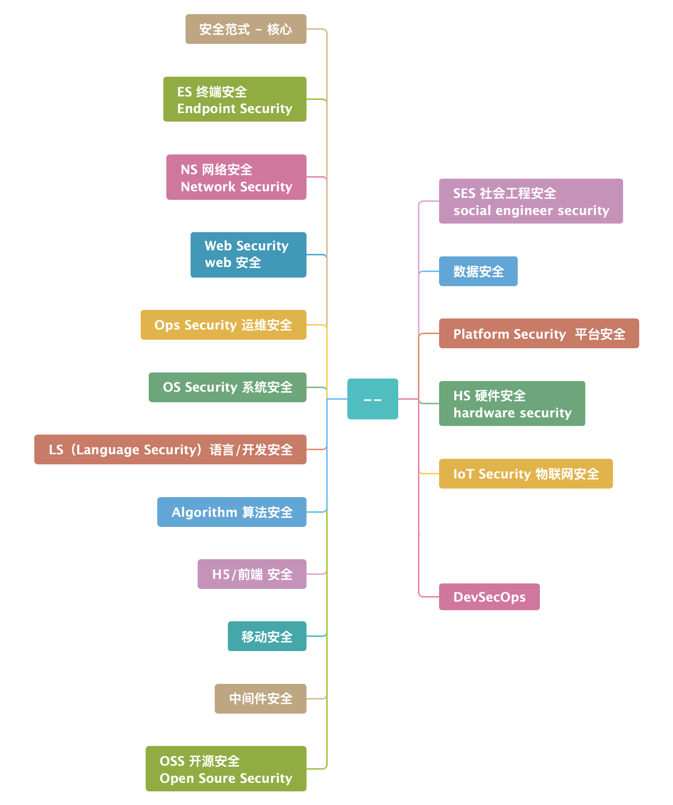
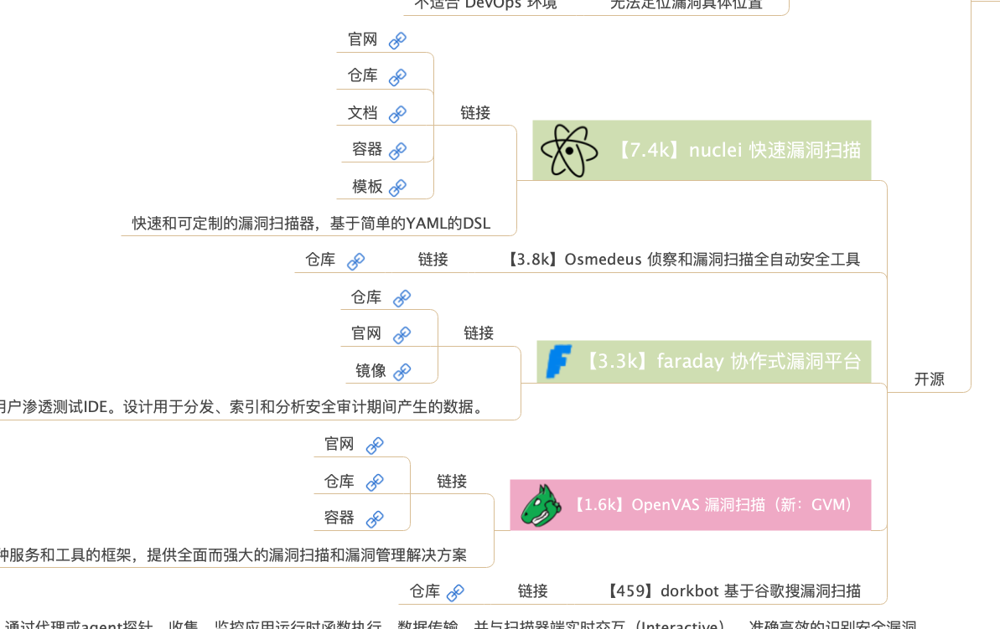
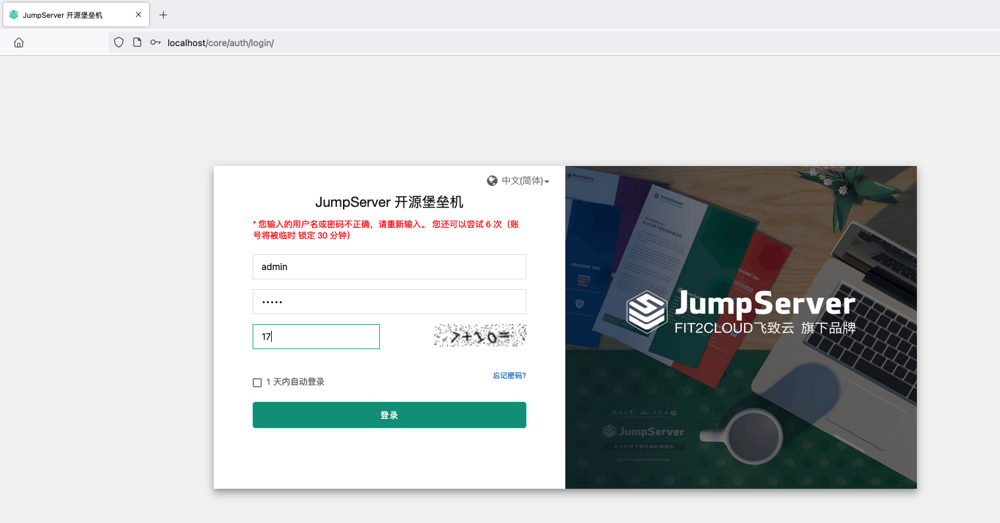
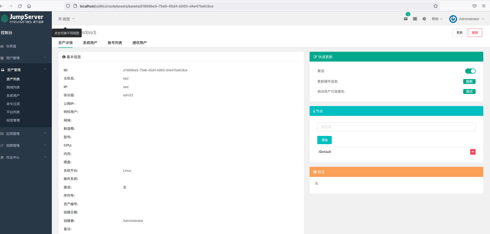
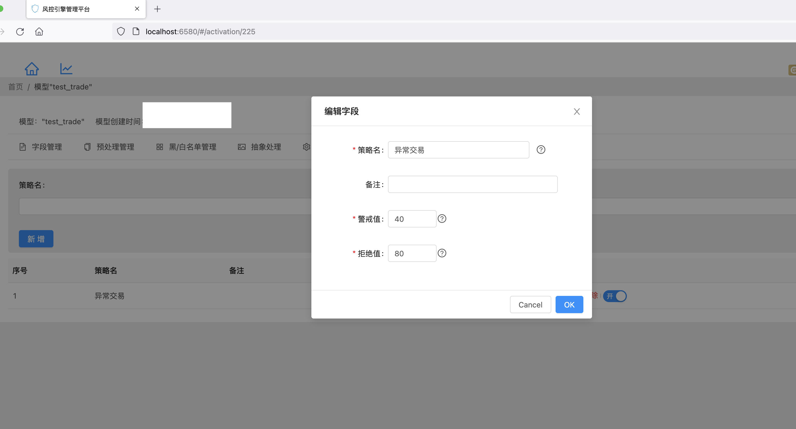
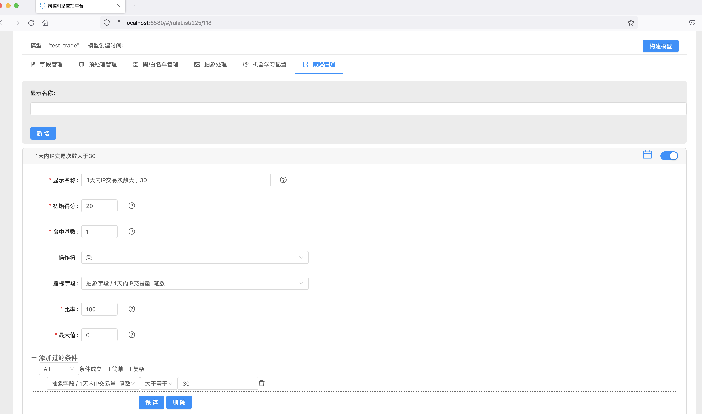
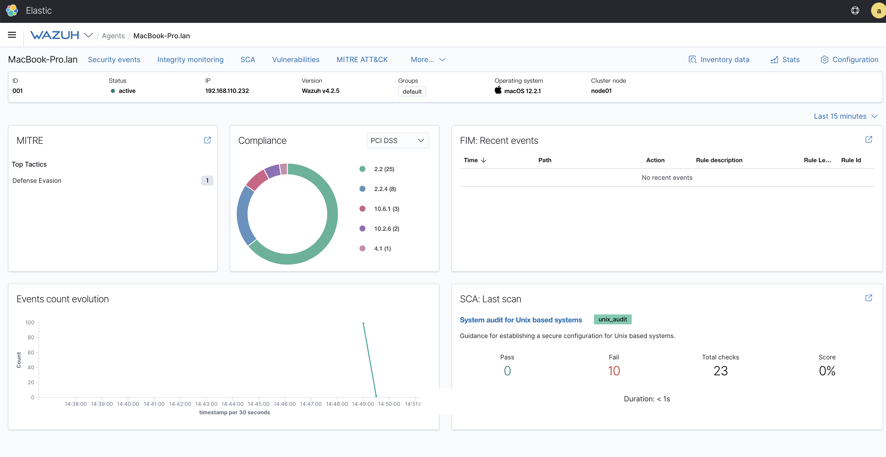
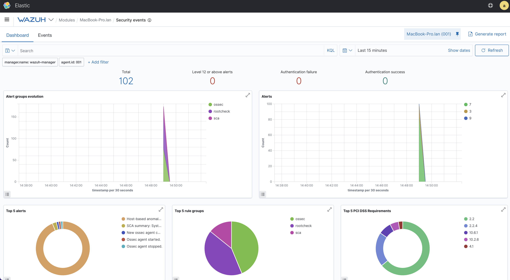

# Awesome Security 

广泛搜集、测试千余款开源安全产品，精心挑选 **300+** 款多star、更新活跃的高质量库，非常适合初学者快速入手安全技术栈、少走弯路。

- 科学分类
  
  几乎涵盖安全领域的大部分主要方向，非常适合初学者快速入手安全技术栈、少走弯路；
  
- 跨平台
  
  基于跨平台的轻量级容器化技术 Docker，可以在windows、macos、linux等系统中运行；
  
- 开箱即用
  
  所有镜像和脚本均反复验证，可以一键部署、测试，减少不必要的自建时间。
  
当前开放 **150** 款左右，后续持续更新中...

### 技术栈脑图

### 运维安全 - 堡垒机

- [jumpserver](https://github.com/jumpserver/jumpserver)

### 业务安全 - 风控

- [radar](https://gitee.com/freshday/radar)

### 网络安全 - 入侵检测 & 防御

- [wazuh](https://github.com/wazuh/wazuh)

